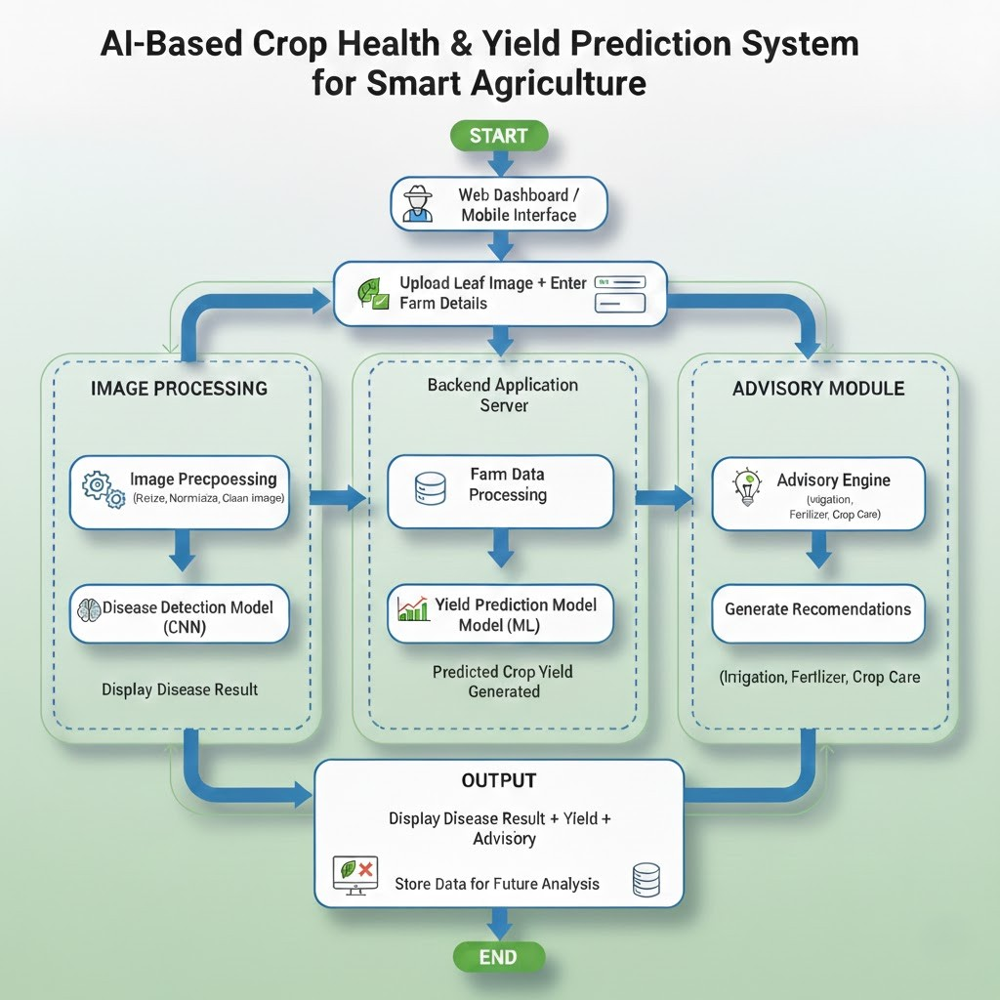

<div align="center">
  <h1>🌱 Smart Agriculture AI System</h1>
  <p>An intelligent, ML-powered platform to empower farmers with data-driven agronomic decisions.</p>

  <!-- Badges -->
  <p>
    
    
    
    
    
    
  </p>
</div>

---

## 📖 Project Overview

The **Smart Agriculture AI System** is a full-stack, AI-powered platform designed to optimize agricultural practices and boost crop yields. By leveraging deep learning and machine learning, the system analyzes complex farm data (soil nutrients, weather, plant images) to provide actionable, precision-farming recommendations. 

The goal of this project is to bridge the gap between advanced artificial intelligence and practical farming, helping farmers reduce crop loss, optimize resource usage, and maximize their harvest potential.

---

## ✨ Features

- 🔍 **AI Disease Detection:** Upload an image of a crop leaf and instantly identify diseases using a fine-tuned EfficientNet deep learning model.
- 🌱 **Crop Recommendation Engine:** Predicts the most suitable crop for your land based on soil nutrients (Nitrogen, Phosphorus, Potassium), pH levels, and local climatic conditions.
- 🧠 **Gemini-Powered Crop Advisory:** Augments the crop recommendation engine with context-aware, generative AI farming advice (e.g., fertilizer split-dosing, biological prevention strategies).
- 💬 **Conversational Farm AI Assistant:** Direct chatbot interface powered by Google Gemini where farmers can dynamically ask questions about crop health, diseases, fertilizers, and irrigation.
- 📈 **Yield Forecasting:** Estimates the expected yield density (hg/ha) for a specific crop and area, factoring in historical trends and solar cycles using an XGBoost regression model.
- 📱 **Interactive Web Dashboard:** A sleek, futuristic, and highly responsive user interface built with React and Tailwind CSS.
- 🛡️ **Confidence Guards:** The AI system provides certainty scores and flags low-confidence predictions to ensure safe agricultural decisions.

---

## 🗄️ Datasets

This project uses multiple datasets for training the AI models. If you want to train the models yourself, download the datasets from the links below and extract them into the correct directories:

### Disease Detection
[PlantVillage Dataset](https://drive.google.com/drive/folders/1hMRYfnG-9OKpa8tB_zbzO9Gw2qUYJ8D2?usp=sharing)  
Place inside: `disease_model/data/`

### Crop Recommendation
[Crop Recommendation Dataset](https://drive.google.com/drive/folders/11-Ld88jJMRRGzNd9bw24utOg51v1GLcc?usp=sharing)  
Place inside: `crop_model/data/`

### Yield Prediction
[Crop Yield Dataset](https://drive.google.com/drive/folders/1SkMuOc498OXxruQy3_EaJsDZy60JF3th?usp=sharing)  
Place inside: `yield_model/data/`

---

## 🏗️ System Architecture

The application is built on a scalable, decoupled microservices architecture:

1. **React Frontend (`frontend/`)**: Provides the interactive user dashboard.
2. **Node.js Backend (`backend/`)**: Acts as a secure proxy server and request manager.
3. **FastAPI ML Server (`ai_api/`)**: High-performance Python API that serves the trained machine learning models.
4. **AI Engine (`smart_system/`)**: The core orchestration layer that handles feature engineering, model inference, and rule-based agronomic advisory logic.



---

## 📂 Project Structure

```text
CropProject/
│
├── ai_api/             # Python FastAPI server for model inference
├── backend/            # Node.js backend proxy server
├── frontend/           # React.js interactive web dashboard
│
├── smart_system/       # Core ML orchestration & advisory logic
│   ├── config.py
│   ├── recommendations.py
│   └── *_engine.py     # Inference engines (Disease, Crop, Yield)
│
├── disease_model/      # Image classification training pipeline (PyTorch EfficientNet)
├── crop_model/         # Classification training pipeline (Scikit-Learn Ensemble)
├── yield_model/        # Regression training pipeline (XGBoost)
│
├── docs/               # Project documentation
├── logs/               # Runtime system logs
└── reports/            # Generated analytical reports
```

---

## 💻 Technologies Used

### Frontend
- **React.js** (Component-based UI)
- **Tailwind CSS** (Styling & Animations)
- **Framer Motion** (Micro-interactions)
- **Recharts** (Data visualization)
- **Axios** (HTTP client)

### Backend (Proxy)
- **Node.js**
- **Express.js**
- **Multer** (File handling)

### AI / Machine Learning (API & Engines)
- **Python 3.10+**
- **FastAPI** (High-performance API)
- **Google Generative AI SDK** (Gemini LLM Integration)
- **PyTorch / Torchvision** (Deep Learning - Computer Vision)
- **Scikit-Learn** (Machine Learning utilities)
- **XGBoost & LightGBM** (Gradient Boosting frameworks)
- **Pandas & NumPy** (Data manipulation)

---

## 🚀 Installation & Setup

Follow these steps to run the Smart Agriculture AI System locally.

### 1. Clone the Repository
```bash
git clone https://github.com/yourusername/Smart-Agriculture-AI.git
cd Smart-Agriculture-AI
```

### 2. Start the AI API (Python)
Ensure Python 3.10+ is installed.
```bash
cd ai_api
# It is recommended to create a virtual environment first
pip install -r requirements.txt
uvicorn api:app --reload --port 8000
```
*The API will be live at `http://localhost:8000`*

### 3. Start the Backend Server (Node.js)
Ensure Node.js is installed.
```bash
# Open a new terminal
cd backend
npm install
npm run dev
```
*The server will run on `http://localhost:5000`*

### 4. Start the Frontend Dashboard (React)
```bash
# Open a new terminal
cd frontend
npm install
npm start
```
*The dashboard will automatically open at `http://localhost:3000`*

---

## 🛠️ How to Use

1. **Detect Crop Disease:** 
   Navigate to the *Diagnostics Hub*. Upload a clear photo of a crop leaf. The system will process the image, identify the exact disease (or confirm if healthy), and provide immediate treatment steps.

2. **Optimize Crop Selection:**
   Navigate to the *Crop Matrix*. Enter your soil test results (Nitrogen, Phosphorus, Potassium, pH) and current weather data. The AI will recommend the top 3 most profitable crops for your specific conditions alongside fertilizer advice.

3. **Forecast Yield Output:**
   Navigate to the *Yield Intelligence* page. Input your geographic area, target crop, and climatic factors. The system will predict the harvest density (hg/ha), display historical trends, and give targeted advice to maximize output.

---

## 📸 Screenshots

| Dashboard Home | Disease Detection |
| :---: | :---: |
| *(Add screenshot here)* | *(Add screenshot here)* |

| Crop Recommendation | Yield Forecasting |
| :---: | :---: |
| *(Add screenshot here)* | *(Add screenshot here)* |

---

## 🔮 Future Improvements

- [ ] **Satellite Data Integration:** Automatically map farm areas to pull real-time NDVI and soil moisture data.
- [ ] **Live Weather API:** Connect to services like OpenWeatherMap to auto-fill climatic inputs for Yield and Crop predictions.
- [ ] **Mobile App Port:** Develop a React Native version for in-field use by farmers.
- [ ] **IoT Sensor Integration:** Create webhooks to consume live telemetry from on-farm NPK and moisture sensors.

---

## 📄 License

This project is licensed under the MIT License - see the [LICENSE](LICENSE) file for details.

---
<div align="center">
  <i>Developed with ❤️ for the future of farming.</i>
</div>